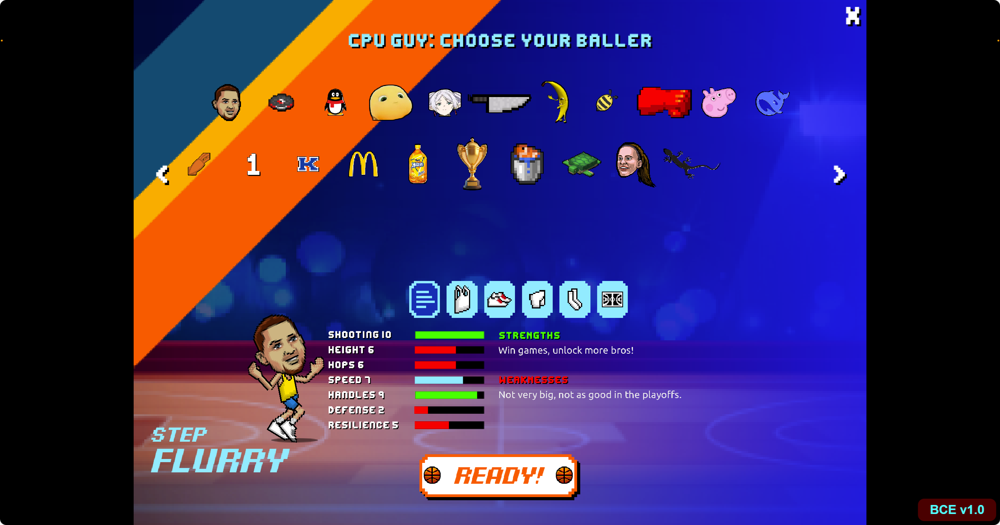

# BasketBros CE

## Deprecated

未来计划：
- 加入Her的Overheat模式（随击败的Boss数增加而削弱，初始2倍数值）
- 加入Mega排行榜
- 自定义字体支持（[方法](https://chat.deepseek.com/share/makx7x4p739m2da16h)），代码中已有示例

## Windows/Mac/Linux 安装步骤（仅支持Chrome/Edge等Chromium浏览器）

1. [下载插件 (选择 Source code (zip))](https://github.com/samas3/basketbros-ce/releases/latest)
2. 打开浏览器，输入地址: `chrome://extensions/`
3. 解压下载的*.zip
4. 把解压后的文件夹拖入浏览器窗口
5. 刷新页面

## Android 安装步骤

1. 下载 Kiwi Browser 并安装打开
2. 在右上角菜单中找到`扩展程序`
3. 打开`开发者模式`
4. 点击`+（from.zip/.crx/.user.js）`，选择*.zip文件打开

## 更新日志
[点击查看](https://github.com/samas3/basketbros-ce/releases)

## 全认出来可以把自己加进去了不怼好像本来就都在 ———— Turr Toe

## 鸣谢
- 开发者：samas 3000
- 数值策划：Squid Oven
- 美术/技能策划：Turr Toe
- 文案：Mac King
